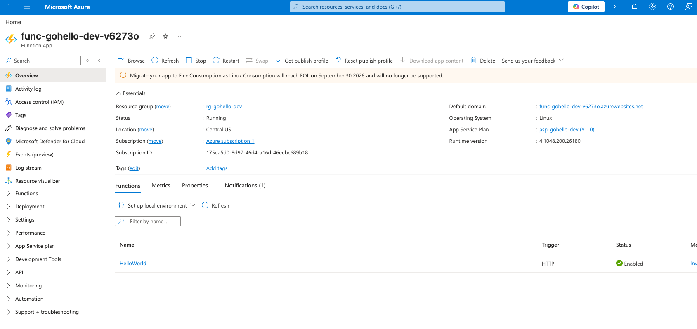
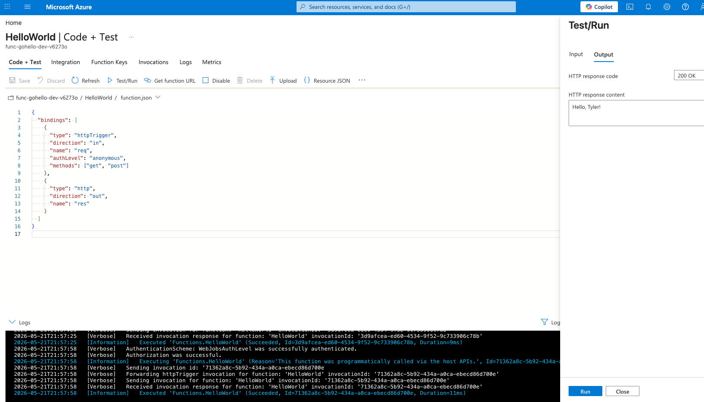

# azure-function-poc

A minimal Go "hello world" Azure Function, deployed to Linux Consumption via Terraform.

Go isn't a first-class Azure Functions language — it runs as a [custom handler](https://learn.microsoft.com/azure/azure-functions/functions-custom-handlers): the Functions host forwards each HTTP request to a Go binary listening on `FUNCTIONS_CUSTOMHANDLER_PORT`, and the Go binary writes the HTTP response.

## What gets deployed

| Resource | Purpose |
| --- | --- |
| Resource Group | Container for everything below |
| Storage Account | `AzureWebJobsStorage` + holds the deployment zip |
| Log Analytics Workspace | Backing store for App Insights |
| Application Insights | Function telemetry |
| App Service Plan (Linux, Y1 Consumption) | Compute |
| Linux Function App | The function host, custom runtime |
| Storage Container + Blob | Holds the packaged Go binary; mounted via `WEBSITE_RUN_FROM_PACKAGE` |

## Prerequisites

- Go 1.22+
- Terraform 1.5+
- Azure CLI, logged in (`az login`) with an enabled subscription
- Enough vCPU quota in the target region for one Y1 Consumption instance

## Layout

```
.
├── main.go                 # Custom handler HTTP server
├── go.mod
├── host.json               # Functions host config (custom handler, forwarding enabled)
├── HelloWorld/
│   └── function.json       # HTTP trigger binding
├── local.settings.json     # Local-only settings (FUNCTIONS_WORKER_RUNTIME=custom)
└── terraform/
    ├── providers.tf
    ├── variables.tf
    ├── main.tf
    └── outputs.tf
```

## Local development

```sh
go build -o handler .
func start            # Requires Azure Functions Core Tools v4
curl "http://localhost:7071/api/HelloWorld?name=tyler"
# -> Hello, tyler!
```

## Deploy

```sh
cd terraform
terraform init
terraform apply
```

Region and naming are controlled in [terraform/variables.tf](terraform/variables.tf). Override per-run with e.g. `terraform apply -var="location=westus2"`.

Terraform will:

1. Cross-compile `main.go` to `linux/amd64` (`null_resource.build_handler`)
2. Zip `host.json`, `HelloWorld/function.json`, and the `handler` binary (`archive_file`)
3. Upload the zip to a private blob container with a content-hashed name
4. Generate a long-lived read-only SAS for the container
5. Create the Function App with `WEBSITE_RUN_FROM_PACKAGE=<SAS URL>` so the runtime mounts the zip on cold start

## Verify

After apply completes:

```sh
curl "$(terraform output -raw hello_world_url)?name=tyler"
# -> Hello, tyler!
```

The first request after deploy may take 10–30s while the runtime cold-mounts the package.

You can also exercise the function from the Azure portal's **Code + Test** pane (the Terraform config allows `https://portal.azure.com` as a CORS origin):





## Cleanup

```sh
cd terraform
terraform destroy
```

## Notes

- **Linux Consumption EOL**: Azure has announced Linux Consumption (Y1) reaches end of life on 2028-09-30. For new production work, prefer [Flex Consumption](https://learn.microsoft.com/azure/azure-functions/flex-consumption-plan); this POC uses Y1 for simplicity.
- **SAS expiry**: the deployment SAS in [terraform/main.tf](terraform/main.tf) expires 2030-01-01. For real deployments, prefer a managed identity with `Storage Blob Data Reader` on the container instead of a long-lived SAS.
- **Handler routing**: `host.json` sets `enableForwardingHttpRequest: true`, so the Go binary sees the original HTTP request directly (path, query, headers, body). The simpler invoke-envelope protocol is also supported by the runtime if you ever need richer binding integration.
